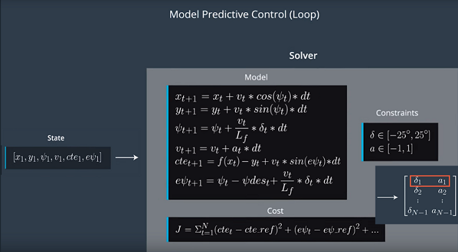

# Autonomous Driving using Predictive Control Model

## Introduction

Goal of this project is to drive a car autonomously around the track in a simulator using a Predictive Control Model.

The Model used in this project is a simple Kinematic Model consisting of Vehicle State and Actuators.

State: State of the vehicle at any point is described by 4 vectors — x position, y position, velocity (v) and the orientation (psi).

Actuators or control inputs are the steering angle (delta) and the throttle value (a). Braking can be expressed as negative throttle. So throttle can have values between -1 an +1. Steering angle is set to be between -25° to +25°.

The Kinematic motion model can be used to predict new state from previous state after steering and throttle are applied.

---
Simulation Result 1:
The speed limit is set to 100 MPH, latency  0.1 sec.

[](https://youtu.be/5KBm8h0J1FY)

Simulation Result 2:
The speed limit is set to 120 MPH, latency  0.1 sec.

[](https://youtu.be/qXX8J04rZaw)

## Vehicle Models

* #### Kinematic Models

Kinematic models are simplifications of dynamic models that ignore tire forces, gravity, and mass.
This simplification reduces the accuracy of the models, but it also makes them more tractable.
At low and moderate speeds, kinematic models often approximate the actual vehicle dynamics.

 


* #### Dynamic Models

Dynamic models aim to embody the actual vehicle dynamics as closely as possible.
They might encompass tire forces, longitudinal and lateral forces, inertia, gravity, air resistance, drag, mass, and the geometry of the vehicle.
Not all dynamic models are created equal! Some may consider more of these factors than others.
Advanced dynamic models even take internal vehicle forces into account - for example, how responsive the chassis suspension is.
The following are elements of dynamic models:
 - Dynamic Model Forces
 - Tire Slip Angle
 - Tire Slip Ratio
 - Tire Models

 
 

* #### Actuator Constraints

In the real vehicles, actuators are limited by the design of the vehicles and fundamental physics. We can set the lower and upper bounds of the actuators. For example, set the steering angel to be between -30 and 30 degrees, and the acceleration to be between -1 and 1 for full brake and full acceleration.


## Implementation

Model Predictive Control takes following a trajectory as an optimization problem, to find the optimal trajectory by minimizing the cost function. Once we found the lowest cost trajectory, we take the new state to calculate a new optimal trajectory, and throw away the rest of predicted trajectory. We are calculating inputs over a future horizon, this is called Receding Horizon Control.


* #### MPC model and algorithm

** Setup **
1. Define the duration of the trajectory, T, by choosing N and dt.
2. Define the vehicle model and constraints such as actual limitations.
3. Define the components of the cost function (state, actuators, etc). 


The kinematic model is made up of :
- State
     * x : axis heading
     * y : bearing away from x
     * psi : bearing angle (yaw) in degrees
     * v : velocity
     * cte : cross-track error; distance of the car from the trajectory
     * epsi : psi error; difference (aka angle) between the car’s orientation and the trajectory orientation

- Lf
    * Length (distance) between front of the car and it’s centre of gravity

- Actuators
    * delta : steering angle in degrees -  in the range [-25°, 25°]
    * a : acceleration / deceleration - in the range [-1, 1] = [full brake, full throttle]

Cost function is -


** Loop **
1. Pass the current state to the model predictive controller.
2. Call the optimization solver to return a vector of control inputs that minimize the cost function.
3. Apply the first control input to the vehicle and repeat the loop.




* #### Timestep Length and Elapsed Duration (N & dt) 

The prediction horizon is the duration over which future predictions are made. We’ll refer to this as T. T = N * dt.

N is the number of timesteps in the horizon. dt is how much time elapses between actuations. They are hyperparameters that one need to tune for each model predictive controller. 

Number of Timesteps
The goal of Model Predictive Control is to optimize the control inputs: [δ,a]. An optimizer will tune these inputs until a low cost vector of control inputs is found. The length of this vector is determined by N:

[δ<sub>1</sub>, a<sub>1</sub>, δ<sub>2</sub>, a<sub>2</sub>, ... , δ<sub>N−1</sub>, a<sub>N−1</sub>]

Thus N determines the number of variables optimized by the MPC. This is also the major driver of computational cost.

In this project, I tried N from 5 to 20, and dt from 0.05 to 0.2, then settle on the following values -
``` python
size_t N = 8; 
double dt = 0.08;
```
This gives prediction time T as 0.64 sec. Since the goal is to drive as fast as possible and stay in the lane, shorter timestep and smaller N allow for quick feedback to meet the car speed demand. However set the values too small also caused instability.

* #### Polynomial Fitting and MPC Preprocessing

The way points provided by the simulator are transformed to the car coordinates.

``` python
// Convert global coordinates to car coordinates
// - Shift the coordinates of ptsx and ptsy to origin of car
// - Rotate the coordinates of ptsx and ptsy to be w.r.t. psi of car
// Polyfit accepts Eigen vector and ptsx and ptsy are std::vectors. Make the conversion
Eigen::VectorXd ptsx_car(ptsx.size());
ptsx_car.fill(0.0);
Eigen::VectorXd ptsy_car(ptsy.size());
ptsy_car.fill(0.0);

double dx;
double dy;
for (size_t i = 0; i < ptsx.size(); i++) {
dx = ptsx[i] - px; //px_next;
dy = ptsy[i] - py; //py_next;

ptsx_car[i] = dx * cos(-psi) - dy * sin(-psi);
ptsy_car[i] = dx * sin(-psi) + dy * cos(-psi);
}
```
Then a 3rd-degree polynomial is fitted to the transformed waypoints.
``` python
auto coeffs = polyfit(ptsx_car, ptsy_car, 3);
```

These polynomial coefficients are used to calculate the cte and epsi of the initial state.
``` python
double cte = polyeval(coeffs, 0);
double epsi = -atan(coeffs[1]);
```
          
* #### Model Predictive Control with Latency

In a real car, an actuation command won't execute instantly - there will be a delay as the command propagates through the system. A realistic delay might be on the order of 100 milliseconds.

This is a problem called "latency", and it's a difficult challenge for some controllers - like a PID controller - to overcome. But a Model Predictive Controller can adapt quite well because we can model this latency in the system.

A contributing factor to latency is actuator dynamics. For example the time elapsed between when you command a steering angle to when that angle is actually achieved. This could easily be modeled by a simple dynamic system and incorporated into the vehicle model. One approach would be running a simulation using the vehicle model starting from the current state for the duration of the latency. The resulting state from the simulation is the new initial state for MPC.

This is my implementation of the latency to the model -

``` python
// Add latency into the model. 
// State after delay.
double delay = 0.1; //Actuator delay (latency) set to 0.1 sec (100 ms).
double x_delay = x + ( v * cos(psi0) * delay );
double y_delay = y + ( v * sin(psi0) * delay );
double psi_delay = psi0 - ( v * delta * delay / Lf );
double v_delay = v + a * delay;
double cte_delay = cte + ( v * sin(epsi) * delay );
double epsi_delay = epsi - ( v * atan(coeffs[1]) * delay / Lf );

// Define the state vector.
Eigen::VectorXd state(6);
state << x_delay, y_delay, psi_delay, v_delay, cte_delay, epsi_delay;

//Find the MPC solution.
auto sol = mpc.Solve(state, coeffs);
 ```


---
## Dependencies

* cmake >= 3.5
 * All OSes: [click here for installation instructions](https://cmake.org/install/)
* make >= 4.1(mac, linux), 3.81(Windows)
  * Linux: make is installed by default on most Linux distros
  * Mac: [install Xcode command line tools to get make](https://developer.apple.com/xcode/features/)
  * Windows: [Click here for installation instructions](http://gnuwin32.sourceforge.net/packages/make.htm)
* gcc/g++ >= 5.4
  * Linux: gcc / g++ is installed by default on most Linux distros
  * Mac: same deal as make - [install Xcode command line tools]((https://developer.apple.com/xcode/features/)
  * Windows: recommend using [MinGW](http://www.mingw.org/)
* [uWebSockets](https://github.com/uWebSockets/uWebSockets)
  * Run either `install-mac.sh` or `install-ubuntu.sh`.
  * If you install from source, checkout to commit `e94b6e1`, i.e.
    ```
    git clone https://github.com/uWebSockets/uWebSockets
    cd uWebSockets
    git checkout e94b6e1
    ```
    Some function signatures have changed in v0.14.x. See [this PR](https://github.com/udacity/CarND-MPC-Project/pull/3) for more details.

* **Ipopt and CppAD:** Please refer to [this document](https://github.com/udacity/CarND-MPC-Project/blob/master/install_Ipopt_CppAD.md) for installation instructions.
* [Eigen](http://eigen.tuxfamily.org/index.php?title=Main_Page). This is already part of the repo so you shouldn't have to worry about it.
* Simulator. You can download these from the [releases tab](https://github.com/udacity/self-driving-car-sim/releases).
* Not a dependency but read the [DATA.md](./DATA.md) for a description of the data sent back from the simulator.


## Basic Build Instructions

1. Clone this repo.
2. Make a build directory: `mkdir build && cd build`
3. Compile: `cmake .. && make`
4. Run it: `./mpc`.

